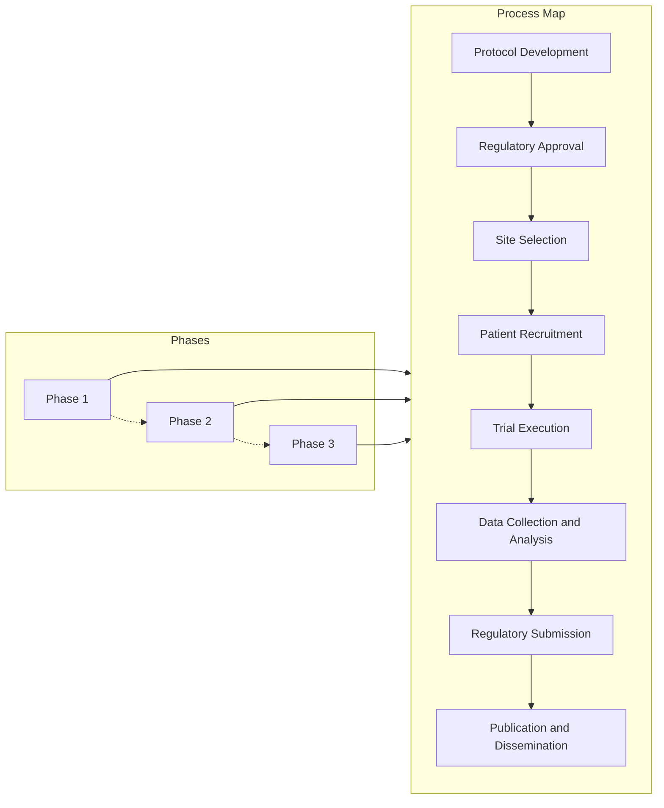
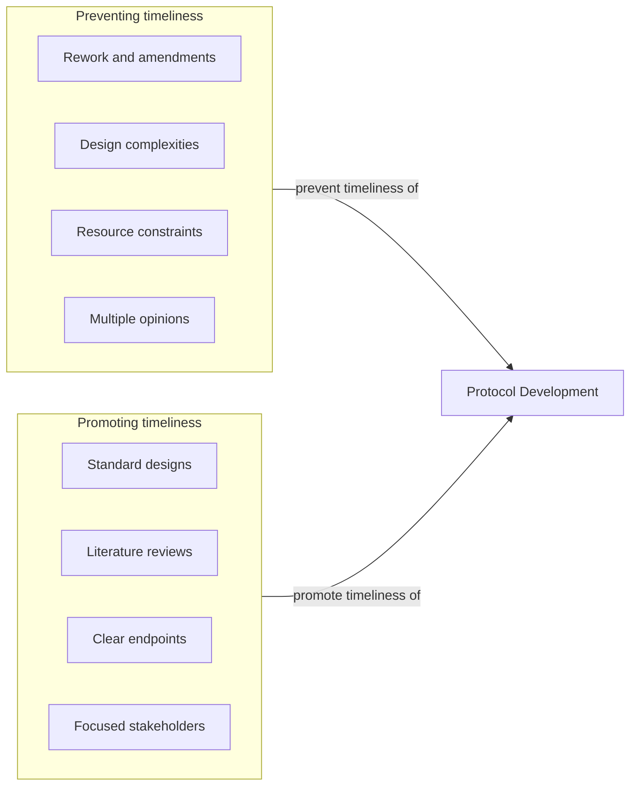
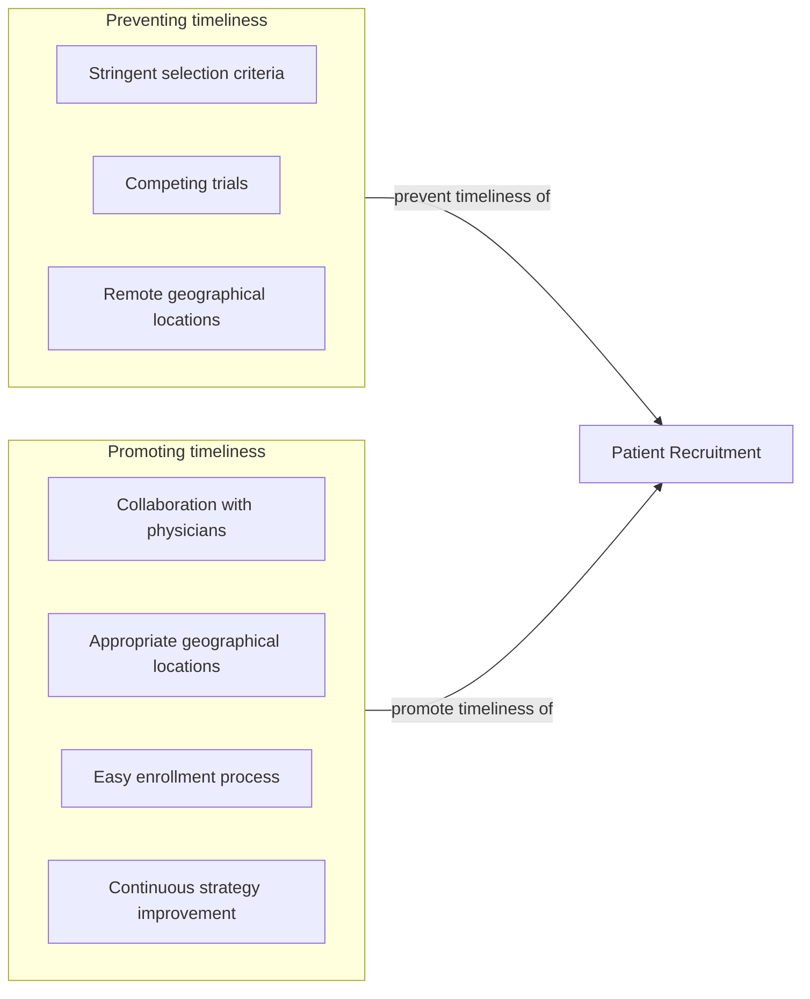
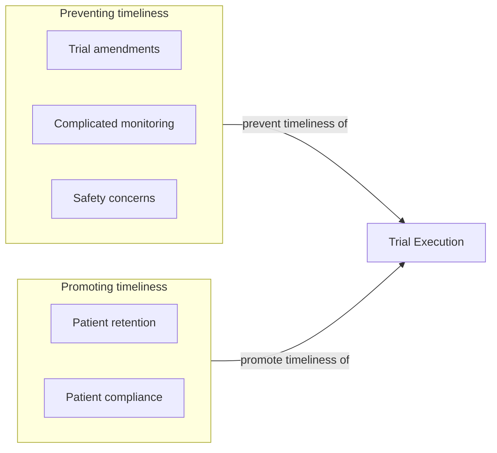

# Speeding Up Clinical Trials
Clinical trials take a long time to complete. Let's examine why through a Value Stream Mapping (VSM).

The first step is to map out the sequential process

For each step, we will ask the questions "what increases the likelihood of timely completion?" and "what lowers the likelihood of timely completion?".

Here are a few examples. First one is for protocol development.

There are likely more points to add, but let's move on to patient reqruitment.

Lastly, let's look at some examples for trial execution

At this point we would dive into each of these identified promoters and preventers of timeliness and ask "why?" until we have identified the most impactful root cause(s) of slowdown in the trial process. Only then would we start considering interventive actions.

However, since we are in a hurry, we'll skip ahead and pick out a specific issue.

Looks like poor quality data is a common root cause, and that is something we can try to fix with ML / statistics.

# Speeding Up Site Selection

We have historical data about clinical trials, the sites they were run at, and the country they were run in. Given this knowledge, we would like a structured approach to site selection for a hypothetical new trial.

Given the available data we could arbitrarily pick any measure or measures that would seem to reflect site quality. Our main obstacle is data completeness. We would not be able to compare sites, where the quality metric is not available.

Let's arbitrarily pick the quality measure `recruitment_speed` which we will calculate for a given trial site as `no_of_patients / enrolled_months`. This seems a sensible criterium, as we would often want to pick the site, which could recruit patients the fastest, so the trial can start quickly or so we can obtain more data within an allotted timeframe.

However, there are some immediate concerns when choosing this metric:
- Is is properly normalised so it is comparable across sites?
- What about sites where `no_of_patients` or `enrolled_months` arent available?
- What about new sites, where comparable clinical trials have never been run before?
- Are previous trials representative for future trials? What if the trials are for different disease areas?

There are probably more valid concerns, but we'll shelf them for now, and focus on the two issues of extrapolation. Sites with missing data and new sites are two sides of the same problem, i.e. we can treat new sites as having missing data.

The problem then becomes one of extrapolating or imputing missing data. Here is what I have done:
 - Combined the datasets
 - Calculated the proposed target variable where possible
 - Split the dataset into observations that require imputation and observations that will be used for fitting the model
 - Selected some example features to work with
 - Defined a Bayesian Linear Regression model
 - Conditioned the model and done the imputation
 - Estimated leave one out cross validation generalisation

 The code is in `site_selection.py`.

 Here are examples of additional things one could do:
  - Structured feature selection
  - Bespoke model
  - More careful priors
  - Model selection using LOO-CV estimates
  - Looked at the posterior predictions for the target value
